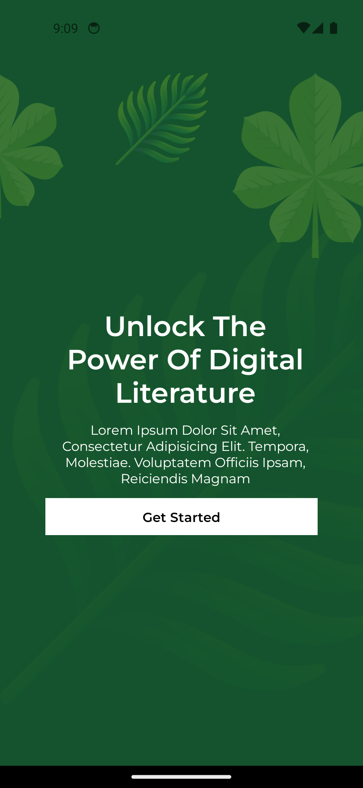
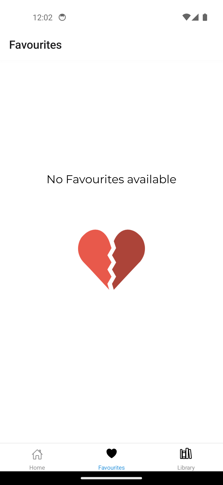
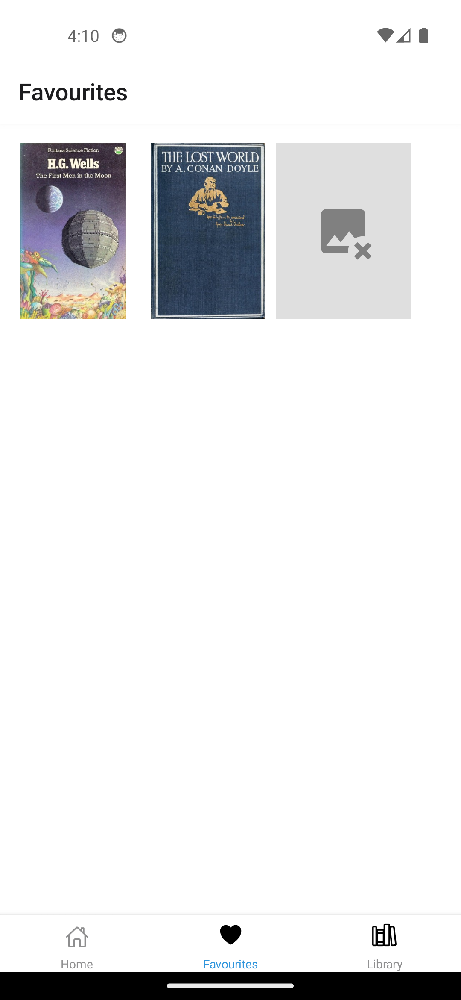
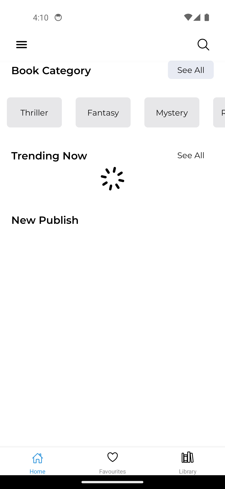
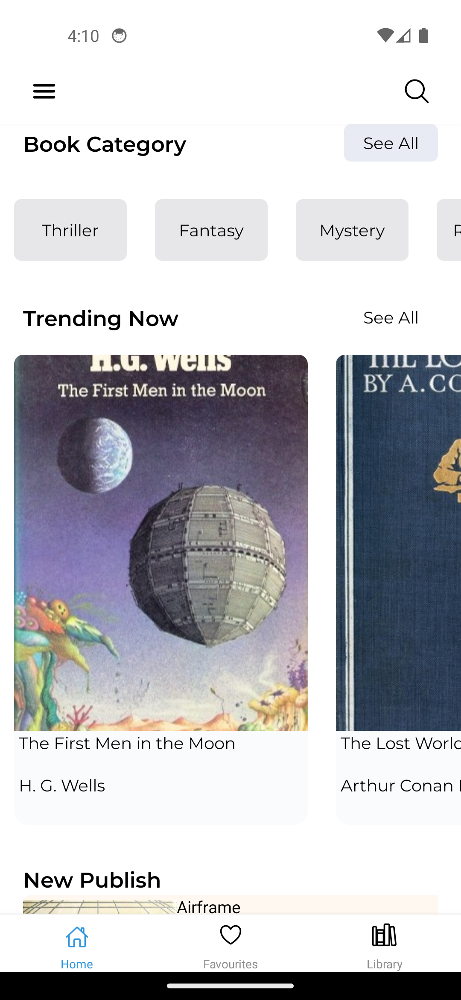

<h1>Novel: Digital Book Heaven</h1>

  With <b>Novel</b> you can search for books , add books to your favourites, read already available books from  
  local media

  <h1>Screenshots:</h1>

  

  <h2>Onboarding Screens </h2>
    
  

 

 

<h2>Main Screens</h2>
 

 

 

  <h1>Features</h1>
  <ul>
    <li><b>Discover:</b>Search and Discover New Books from The Open Lib API</li>
    <li><b>Upload Books:</b>Future Feature that will allow users to upload and read books from their local storage</li>
    <li><b>Save Books:</b>Save Books to a favouriites storage that is persisted on the users phone storage</li>
    <li><b>Authentication:</b>Intergrated the Apple authentication for easier login</li>
        
  </ul>
  <h1>Tech Stack Used</h1>
  <ul>
    <li><b>Framework:React Native</b></li>
    <li><b>Tools:Expo</b></li>
    <li><b>Language:Typescript</b></li>
    
    
        
  </ul>

  

