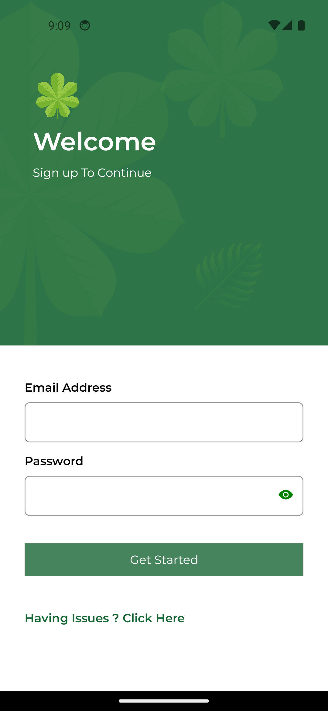

<h1>Novel: Digital Book Heaven</h1>

  With <b>Novel</b> you can search for books , add books to your favourites, read already available books from  
  local media

  <h1>Screenshots:</h1>

  

  <h2>Onboarding Screens </h2>
    
  

 

 

<h2>Main Screens</h2>
 

 

 

  

